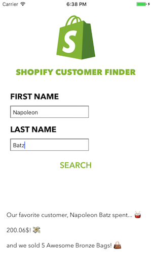

# ShopifyCustomerFinder

If you are here, it's probably because you are searching too the ultimate question of life, the universe and everything :   
How much, our favorite customer, ⭐️ **Napoleon Batz** ⭐️, spent in our shop?

The answer is...  

42. 
No it's not, I'm kidding it's **200.06$**. Just see for yourself.

The Second question is also answered in this beautiful application made with Xcode and developped entirely in Swift (👷🏻).

We sold **5 Awesome Bronze Bags**. Not going to lie, we could have sold more of it, but hey, that's life.

Impressed by my skills in UX, in UI or in Emojis? 👍  
Let's meet! 🤝

         

Psssssst! You don't understand what I said above? 🤔  
Probably because it's not for you 😉
